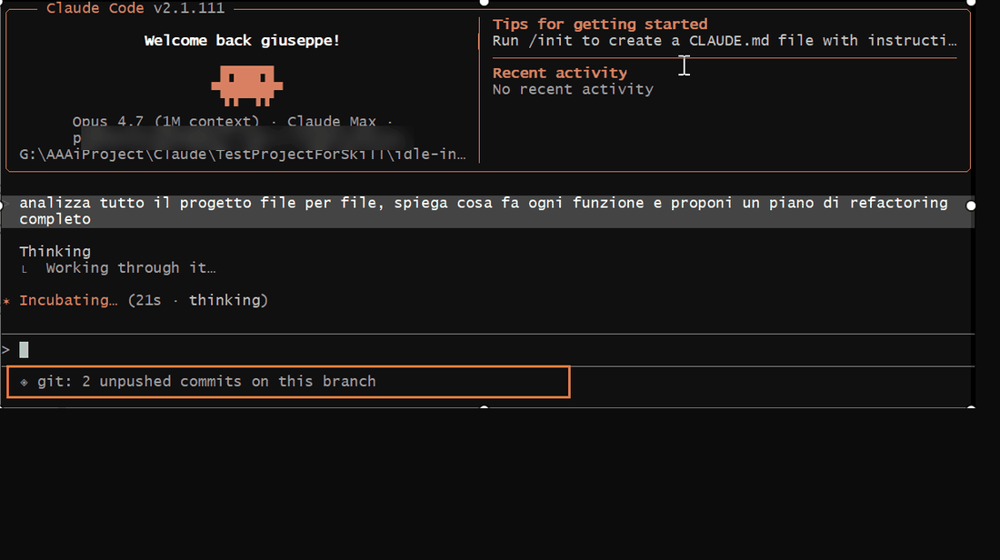

# idle-intel



**The status line is the most-watched line on a developer's screen while an AI agent thinks. Today it says "Thinking...". It could say something worth knowing.**

idle-intel replaces Claude Code's empty wait state with rotating micro-briefings about the project you're already working on:

```
◈ npm audit: 0 critical, 1 high severity vulns -> run `npm audit fix`
◈ git: 2 unpushed commits on this branch
◈ git: 1 stash sitting around -- still needed?
◈ 2 FIXME markers in the codebase -- oldest debts bite hardest
```

One line at a time, rotating every 12 seconds. Zero interruption, zero network beyond your own package manager, zero telemetry.

## Why

Tools have appeared that fill the agent wait state with ads. This project is the opposite bet: **the wait state is valuable because it's empty** — the only moment a developer looks at the screen without acting. Filling it with generic content destroys it; filling it with one glanceable fact about *your own project* respects it. Vulnerabilities you haven't patched, commits you haven't pushed, debt you've stopped seeing.

## What it detects

| Collector | Insights |
|---|---|
| npm | known vulnerabilities (`npm audit`), major updates, pending minor/patch updates |
| pip | outdated packages |
| git | unpushed commits, forgotten stashes, branches untouched 30+ days |
| codebase | TODO / FIXME counts, oversized `node_modules` |

Each collector activates only if its manifest and tool are present, and fails silently otherwise. All facts are local. Nothing is uploaded anywhere.

## Architecture

Two-speed design:

- **Fast path** (`statusline.sh`, pure bash, ~20ms): reads one line from a cache, rotates by time. Runs on every status line refresh.
- **Slow path** (`collect.py`, stdlib-only Python): scans the project and rewrites the cache atomically. Triggered in the background when the cache is older than 30 minutes.

The status line never waits for a scan. Cache lives in `<project>/.claude/idle-intel/cache.txt`.

## Install

### As a Claude Code plugin

```
/plugin marketplace add demartinogiuseppe/idle-intel
/plugin install idle-intel@the-deeper-layer
```

Then ask Claude Code to "set up idle-intel" — the skill walks it through wiring your `settings.json`.

### Manual (Linux / macOS)

```bash
mkdir -p ~/.claude/idle-intel
cp plugins/idle-intel/skills/idle-intel/scripts/* ~/.claude/idle-intel/
chmod +x ~/.claude/idle-intel/statusline.sh
```

Add to `~/.claude/settings.json`:

```json
"statusLine": {
  "type": "command",
  "command": "~/.claude/idle-intel/statusline.sh"
}
```

### Manual (Windows)

Windows needs a `.cmd` wrapper because Claude Code runs status line commands outside Git Bash, where quoting nested paths with spaces ("Program Files") breaks, and where `C:\Windows\System32\bash.exe` (WSL) shadows Git's bash. Create `statusline.cmd` next to the scripts:

```bat
@echo off
"C:\Program Files\Git\usr\bin\bash.exe" "C:\path\to\idle-intel\scripts\statusline.sh"
```

And point `settings.json` at the wrapper with forward slashes:

```json
"statusLine": {
  "type": "command",
  "command": "C:/path/to/idle-intel/scripts/statusline.cmd"
}
```

Requirements: `git` (ships with Git Bash), `python` 3.8+. `npm` and `pip` optional.

## Test before you trust

The `test-kit/` folder contains `make-demo.sh`: it builds a disposable demo project containing **seven planted defects** (a real lodash CVE, unpushed commits against a local fake remote, a stash, a backdated stale branch, known TODO/FIXME counts) so you can verify every collector against a known-answer checklist:

```bash
bash test-kit/make-demo.sh
bash plugins/idle-intel/skills/idle-intel/scripts/test.sh ./idle-intel-demo
```

Expected: 7/7 insights, statusline execution well under 300ms. Tested on Linux and Windows 10/11 (Git Bash).

## Extending

Collectors are plain functions in `collect.py`: `(root: Path) -> list[str]`, registered in one tuple, never allowed to raise. PRs welcome for `Cargo.toml` / `go.mod` support, license-conflict detection, or changelog highlights for recently bumped dependencies.

## Uninstall

Remove the `statusLine` block from `~/.claude/settings.json`. Delete `<project>/.claude/idle-intel/` caches freely.

## License

MIT
